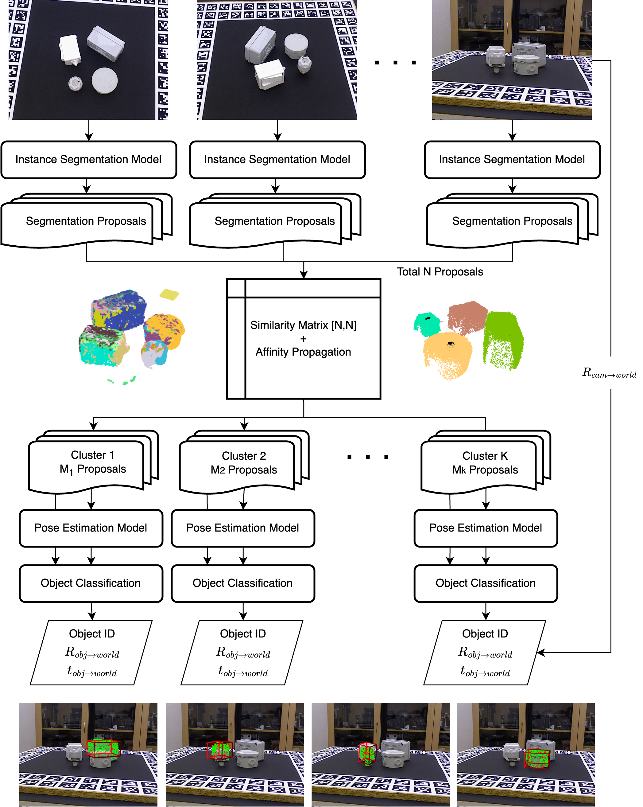

# <p align="center"> <font color=#008000>Multi-view SAM-6D</font>: Improving Zero-Shot 6D Object Pose Estimation via Multi-View Aggregation</p>

| This is a coursework project for the 3D Vision course (Spring 2025) at ETH Zürich.


## 🔍 Project Overview



Multi-view SAM-6D is based on the original SAM-6D framework and extends it to a multi-view setting.

Key features:
- Multi-view fusion: Leverages multiple viewpoints to reduce occlusion and misclassification errors.
- Architecture-level improvement: No retraining of the original SAM-6D modules is required.
- Improved performance: Outperforms single-view methods, especially in cluttered or symmetric scenes.


## Version check
Validated with following environment: 
- CUDA 11.8
- python 3.9.6
- pytorch 2.0.0+cu117


## Getting Started

### 1. Preparation
Please clone the repository locally:
```
git clone https://github.com/oxcarxierra/SAM-6D.git
conda create env sam6d python=3.9.6
cd SAM-6D && pip install requirements.txt
```

Install the environment and download the model checkpoints:
```
sh prepare.sh
```

Also, for the demo run use example data that can be downloaded from [here]().

### 2. Demo run
To run both Instance Segmentation Model and Pose Estimation Model

```bash
cd SAM-6D
sh demo.sh
```

To use pre-acquired results from Instance Segmentation Model, download result file from [here]() and place in `Instance_Segmentation_Model/log/sam/result_tless_ism.json`.

```bash
cd SAM-6D/Pose_Estimation_Model
sh test_bop.sh
```

## Citation

If you use this code or idea in your work, please cite the original SAM-6D paper:

```bibtex
@article{lin2023sam,
  title={SAM-6D: Segment Anything Model Meets Zero-Shot 6D Object Pose Estimation},
  author={Lin, Jiehong and Liu, Lihua and Lu, Dekun and Jia, Kui},
  journal={arXiv preprint arXiv:2311.15707},
  year={2023}
}
```
