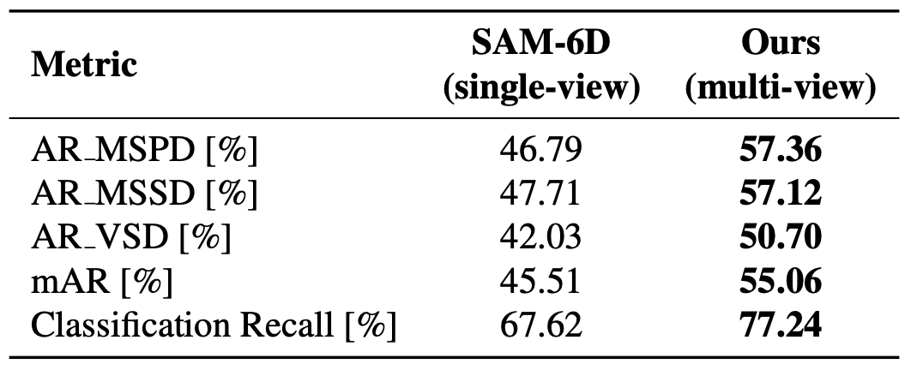

# <p align="center"> <font color=#008000>Multi-View SAM-6D</font>: Improving Zero-Shot 6D Object Pose Estimation via Multi-View Aggregation</p>

| This is a coursework project for the 3D Vision course (Spring 2025) at ETH Zürich.


## 🔍 Project Overview


Multi-View SAM-6D is based on the original SAM-6D framework and extends it to a multi-view setting.

Key features:
- Multi-View fusion: Leverages multiple viewpoints to reduce occlusion and misclassification errors.
- Architecture-level improvement: No retraining of the original SAM-6D modules is required.
- Improved performance: Outperforms single-view methods, especially in cluttered or symmetric scenes.

The core implementation of our multi-view extension can be found in the following files:

- `Pose_Estimation_Model/test_bop_multiview.py` 
- `Pose_Estimation_Model/provider/bop_multiview_test_dataset.py`
- `Pose_Estimation_Model/model/multiview_pose_estimation_model.py`
- `Pose_Estimation_Model/model/feature_extraction.py`


<center>
    
</center>

## Version check
Validated with following environment: 
- CUDA 11.8
- python 3.9.6
- pytorch 2.0.0+cu117

## Getting Started

### 1. Preparation
Please clone the repository locally:
```
git clone https://github.com/oxcarxierra/Multi-View-SAM-6D.git
conda create env sam6d python=3.9.6
cd SAM-6D && pip install requirements.txt
```

Install the environment and download the model checkpoints:
```
sh prepare.sh
```

Also, for the demo run use example data that can be downloaded from [here](https://drive.google.com/file/d/1xvcLY7Y7xjXKOSCwrHqQV3OdssjMuPOp/view?usp=sharing).

### 2. Demo run
To run both Instance Segmentation Model and Pose Estimation Model

```bash
cd SAM-6D
sh demo.sh
```

To use pre-acquired results from Instance Segmentation Model, download result file from [here](https://drive.google.com/file/d/1gZw8sRvr-8C2gbzO8yfg5151Sw-_Wvx3/view?usp=sharing) and place in `Instance_Segmentation_Model/log/sam/result_tless_ism.json`.
This result was obtained using SAM on a GTX 1080 GPU.

```bash
cd SAM-6D/Pose_Estimation_Model
sh test_bop.sh
```

### 3. External libraries


| Library | Version | Link |
|---------|---------|------|
| torch | 2.0.0 | [https://pypi.org/project/torch/](https://pypi.org/project/torch/) |
| torchvision | 0.15.1 | [https://pypi.org/project/torchvision/](https://pypi.org/project/torchvision/) |
| pytorch-lightning | 1.8.1 | [https://pypi.org/project/pytorch-lightning/](https://pypi.org/project/pytorch-lightning/) |
| segment-anything | commit dca509fe793f601edb92606367a655c15ac00fdf | [https://github.com/facebookresearch/segment-anything](https://github.com/facebookresearch/segment-anything) |
| fvcore | 0.1.5.post20221221 | [https://github.com/facebookresearch/fvcore](https://github.com/facebookresearch/fvcore) |
| gorilla-core | 0.2.7.8 | [https://pypi.org/project/gorilla-core/](https://pypi.org/project/gorilla-core/) |
| opencv-python | 4.11.0.86 | [https://pypi.org/project/opencv-python/](https://pypi.org/project/opencv-python/) |
| scikit-learn | 1.6.1 | [https://pypi.org/project/scikit-learn/](https://pypi.org/project/scikit-learn/) |
| scipy | 1.13.1 | [https://pypi.org/project/scipy/](https://pypi.org/project/scipy/) |
| pandas | 2.2.3 | [https://pypi.org/project/pandas/](https://pypi.org/project/pandas/) |
| matplotlib | 3.9.4 | [https://pypi.org/project/matplotlib/](https://pypi.org/project/matplotlib/) |
| tqdm | 4.67.1 | [https://pypi.org/project/tqdm/](https://pypi.org/project/tqdm/) |
| trimesh | 4.0.8 | [https://pypi.org/project/trimesh/](https://pypi.org/project/trimesh/) |
| pillow (PIL) | 11.1.0 | [https://pypi.org/project/Pillow/](https://pypi.org/project/Pillow/) |
| numpy | 1.24.4 | [https://pypi.org/project/numpy/](https://pypi.org/project/numpy/) |


## Citation

If you use this code or idea in your work, please cite the original SAM-6D paper:

```bibtex
@article{lin2023sam,
  title={SAM-6D: Segment Anything Model Meets Zero-Shot 6D Object Pose Estimation},
  author={Lin, Jiehong and Liu, Lihua and Lu, Dekun and Jia, Kui},
  journal={arXiv preprint arXiv:2311.15707},
  year={2023}
}
```
